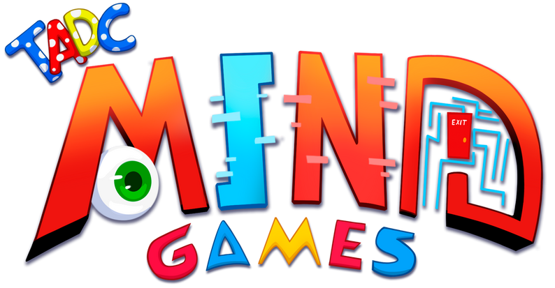
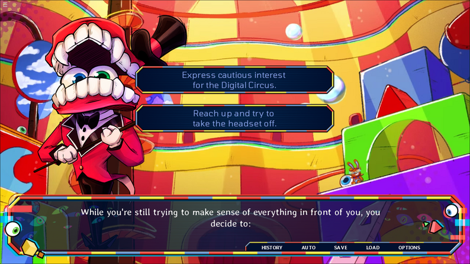
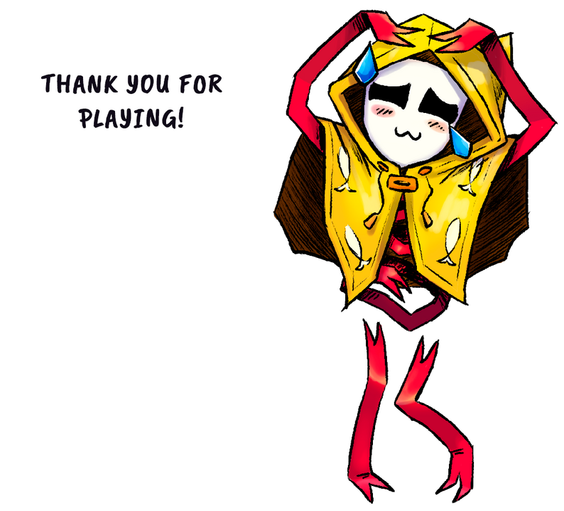
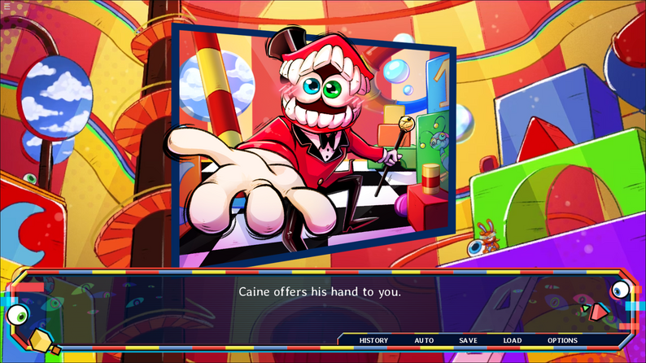
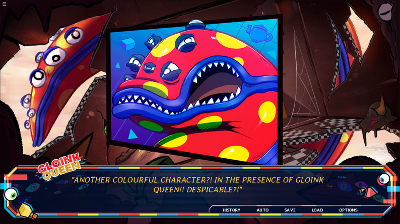

# 🎪 TADC Mind Games

A psychological horror visual novel set in a surreal digital circus world.

Experience branching choices, unstable characters, and multiple endings in this free browser-playable demo.

---

## 🎮 Play the Game

👉 Play online instantly:  
https://tadc-mind-games.com/

No download required — runs directly in your browser.

---

## 🧠 Version

**Demo Version:** v0.1 (First Public Demo Release)  
**Status:** In Development

This is an early demo showcasing a small part of the full game experience.

---

## 🎭 About the Game

TADC Mind Games is a narrative-driven psychological horror visual novel where every choice affects the story.

Players explore a surreal digital circus filled with unstable characters, branching dialogue paths, and multiple possible endings.

---

## ⚙️ Key Features

- 🎮 Free browser-based gameplay  
- 🌌 Surreal digital circus setting  
- 🔀 Branching narrative choices  
- 🔁 Multiple endings system  
- 🧠 Psychological horror atmosphere  
- 🎨 Stylized visual novel presentation  
- 📖 Story-rich experience  

---

## 🏷️ Tags

2D · Fangame · Horror · Indie · Multiple Endings · Ren’Py · Singleplayer · Story Rich

---

## 🖼️ Screenshots

.png)

---

## 🌐 Platforms

- Browser (recommended)
- Windows
- macOS
- Linux

---

## 🔗 Links

- 🎮 Play Game: https://tadc-mind-games.com/
- 🌐 Game Page: https://tadc-mind-games.com/

---

## 🧠 Notes

This repository is used for game presentation, screenshots, and discoverability across search engines.

---

## 📌 Disclaimer

All assets belong to their respective owners. This project is a game showcase page and does not host or modify original game engines or assets.
